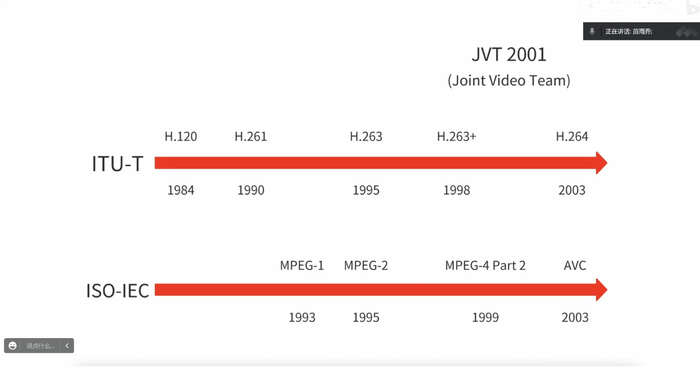
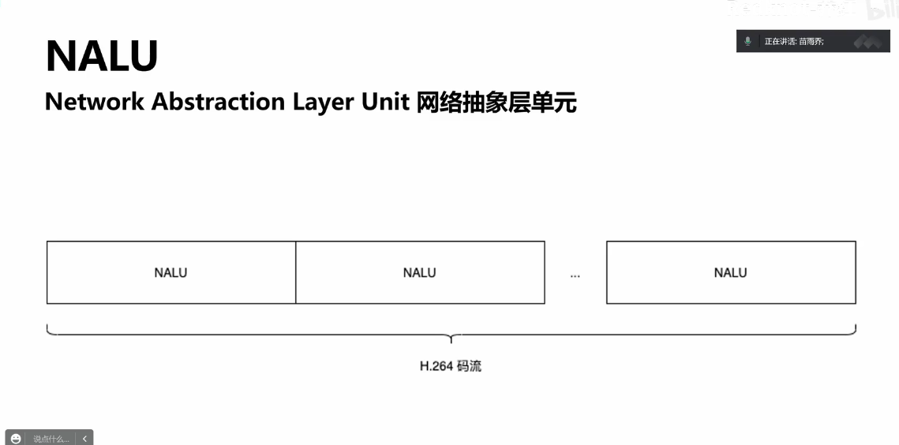
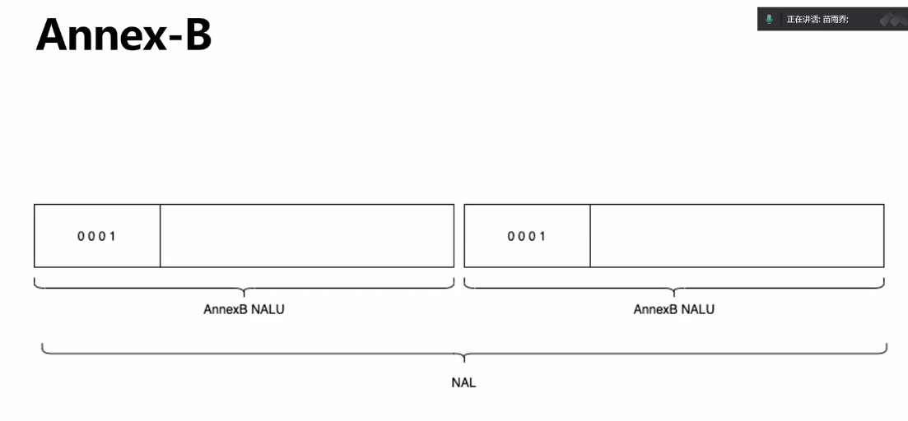
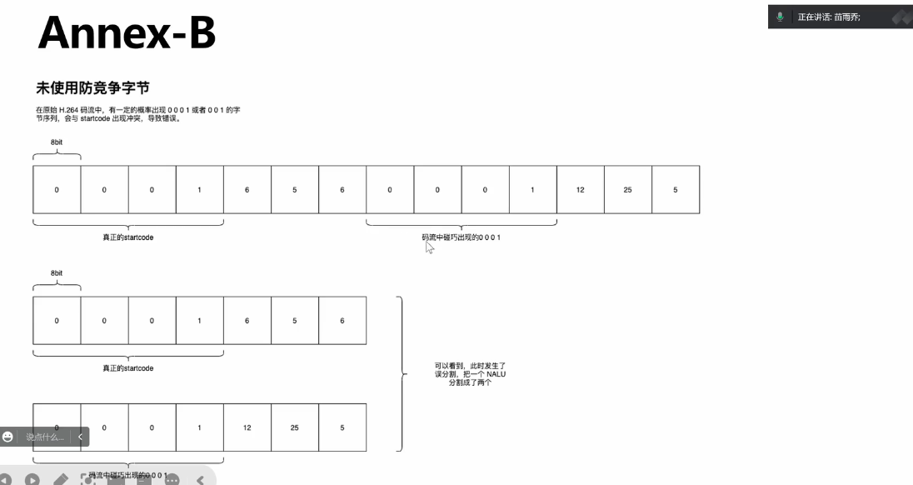
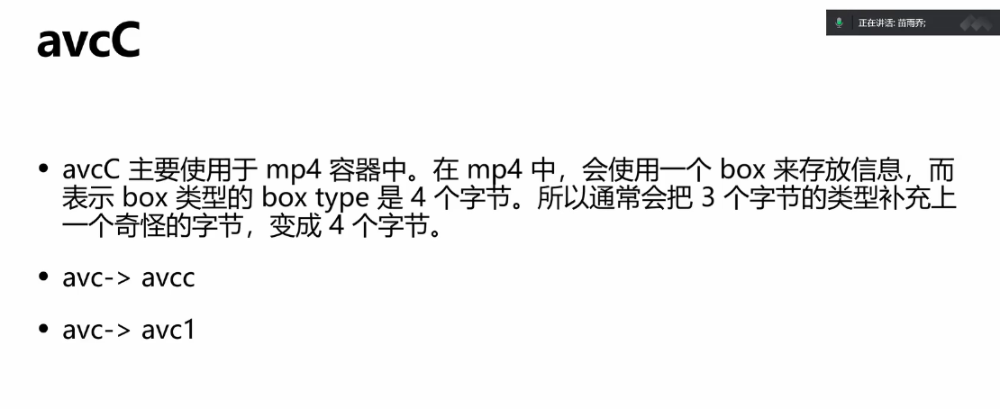

H264/AVC发展历史





-------
NALU(Network Abstraction Layer Unit)
```angular2html
H264本身除了图像信息什么也没有


```

### 两种封装格式
#### Annex-B
```angular2html
ITU-T 的H264标准文档的附录B中，得名Annex-B
```


```angular2html
0001 StartCode 
or 001?

代码要兼容
```



```angular2html
分割符冲突
NALU 添加startcode 之前 对000 001 002 003作修改
```

-----
 000 => 0030 
-----
|001|0031|
------
|002|0032|
----
|003|0033|
-----

#### avcC
